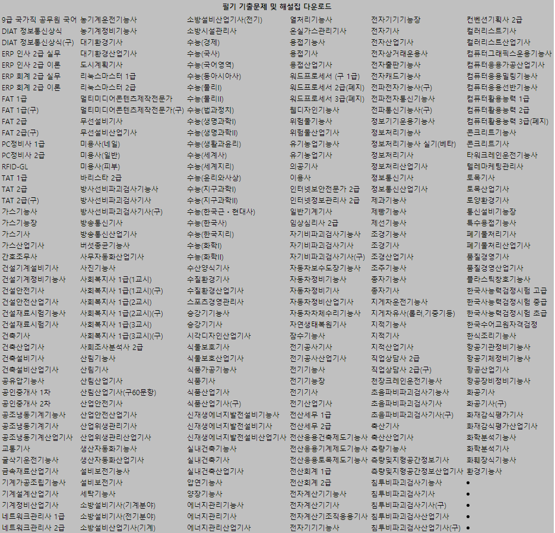

# Crawler : National Techical Certification's Previous Examination Questions

## How to use
1. Execute .exe file which is in dist folder.
2. Write certification name or substring which you want to download.
3. Wait until download is complete.

All files are downloaded from https://www.comcbt.com/   

   
